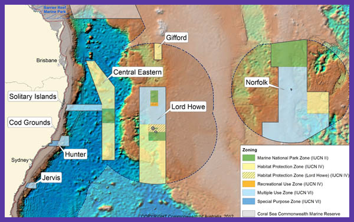

# Proposal for applied thesis chapter

## Summary
Investigate how the Commonwealth marine parks (particularly the Temperate East Commonwealth Marine Reserves Network) assist in the connectivity of the threatened black cod (*Epinephelus daemelii*). Do the current marine parks fulfil the goal of protecting this vulnerable species or are we missing important connectivity to larval settling areas.

## Conservation status
Listed as vulnerable in August 2012 by the the Environment Minister. It has been protected since 1983 under NSW fisheries legislation. Therefore this is an **important** fish in the scheme of things. Interesting results could be good for outreach, e.g. conversation articles, blog posts.

## Study locations
The locations of the commonwealth marine reserves (overlap in conjunction with the NSW marine reserves, see attached). The cod spawning grounds are lord howe island and solitary islands.

## Biology
The larvae recruit to coastal rockpools (the juveniles later move into estuaries).

### Distribution
Found in warm temperate to temperate waters of south-eastern Australia, from southern Queensland to Mallacoota, Victoria (rarely further westwards), Tasman Sea islands and seamounts – Norfolk Island, Elizabeth and Middleton Reefs, Lord Howe Island, to New Zealand – the Kermadec Islands, the North Island and the Poor Knights Islands. Depth range 1-50 m.
Inhabits caves, gutters and crevices usually to depths of 50 m, although individuals have been collected from below 100 m. Juveniles are found inshore, often in coastal rockpools and estuaries.
Black Rockcod are very territorial and individuals have relatively small home ranges. Smaller individuals are regularly seen in caves and gutters around Lord Howe Island. Are abundant at Middleton and Elizabeth reefs, in the Lord Howe marine protected area. They are also found 
at Norfolk island.
Black cod are known to occur to some degree in all six NSW Marine Parks – Lord Howe, Cape Byron, Solitary Island, Port Stephens, Jervis Bay and Batemans Bay.

Queensland and Victoria are the extreme bounds of its distribution (will this change with warming waters?)
http://onlinelibrary.wiley.com/doi/10.1111/jfb.12179/abstract

*Note:* Preliminary research based on small sample sizes suggests the Elizabeth and Middleton Reef black cod population may be of the same genetic stock as NSW populations, which in turn suggests that larval drift may be sufficient to prevent genetic differentiation in black cod populations along and off the NSW coastline.

Black cod in NZ waters appear to be vagrants, as no known breeding or recruitment grounds.

### Early-life history
So far the best option is to use data found for other Epinephelus and use an average of those. There is a lot known about other species in the family. There are 89 species in the family, but aim for other temperate species data.
[Epinephelus species list](http://www.fishbase.org/identification/SpeciesList.php?genus=Epinephelus)

- *Epinephelus marginatus* was used in a connectivity study testing connectivity of MPAs in the Mediterranean.
- *Epinephelus quernus* was using in a connectivity study in the Hawaii

From Jeff Leis:
*Hi - as far as I am aware, the larvae of E. daemelii are unknown, although they almost certainly share the normal characteristics of larvae of that genus.  As far as other temperate species of Epinephelus, there may be something in one of the NOAA/NMFS larval fish identification Atlases edited by Richards for the Western Atlantic or by Moser for the Eastern Pacific. Most of the PLD data on Epinephelus spp comes from lab rearings, and are probably not very representative of what happens in the ocean.  There are several papers that have complied PLD data for a broad range of species to look at different variables and their relation to PLD.  You might find something in those.*

#### PLD
Their pelagic larval stage lasts up to 60 days (Heemstra and Randall 1993; Richardson and Gold 1997)
Medium-to large-bodied groupers range from 30–80 days. I have contacted Dave Harasti (emailed 7/3), asking for more information, fingers crossed they have unpublished otolith data.

#### Spawning
Adults generally inhabit coastal rocky reefs and offshore coral reefs.
Epinephelus species produce pelagic eggs in several spawning bouts (Coleman et al. 1999)

From Dave Harsti (personal comm)
*we think it's around April-May, as this is when they have been record aggregating at sites in the northern part of the state.*

#### Settlement
*Taken from Harasti's paper*
Post-larval and juvenile E. daemelii (,30-cm total length (TL)) occur mainly in rock pools and shallow rocky intertidal areas.
In NSW, juvenile E. daemelii are more common along the central to southern coast (,32–358S) than in northern NSW (,28–318S; Harasti et al. 2014). This is likely a result of larval dispersal by the East Australian Current (EAC), a western boundary current with jets and eddies that can transport larvae southwards from northern NSW (Booth et al. 2007). However, north-to-south coastal connectivity and successful recruitment are likely to be highly variable at a range of temporal scales, because the EAC often separates from the Australian mainland coast around Smoky Cape (,318S; Syahailatua et al. 2011; Cetina-Heredia et al. 2014).

#### Mortality
Use generic values from the literature.

#### Vertical migration
Again, no known values at this moment.

#### Orientation (+ horizontal swimming)
Would like to include, but do not know if I will have enough information.

## Marine park connectivity
Use both commonwealth & NSW no-take areas where they occur in known areas. The idea would be to investigate the connectivity of the cod and how the marine parks might protect the species, especially as the juveniles are so territorial and can remain in or near rockpools until 30cm.

## The model

### Inputs
- release larvae from known spots in the literature, assume all populations are spawning populations
- unsure whether to release more in area with greater numbers?
- use PLDs perhaps centred around 45 with SD of 10, cover bases with values ranging from ~30-60 days
- need to find some data on ontogenetic vertical migration, emailing Tony for growth data. Is there anything in his book about lengths?
- use a total of 10 years to evaluate dispersal over time, but the most recent years to reflect when numbers were sufficiently low to list as vulnerable.
- other standard values used from means in the review (e.g. buffer)
- implemented behaviour depends on what we can find out

### Measuring outputs
- use the nMDS approach to compare within and between years
- need to test effectiveness of the connectivity between marine parks, e.g. are the strongest areas of settlement located inside marine parks?
- think about the statistical analysis to be used
