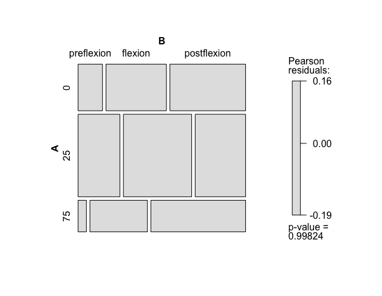
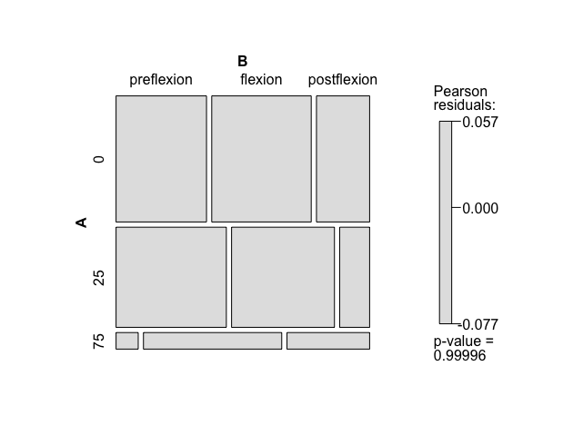
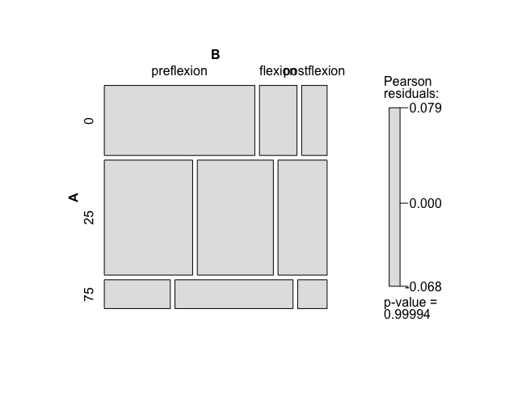
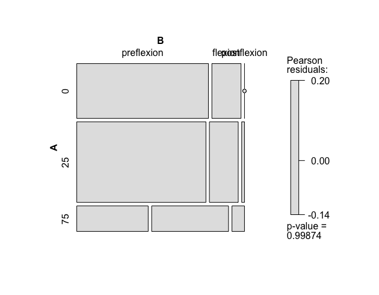
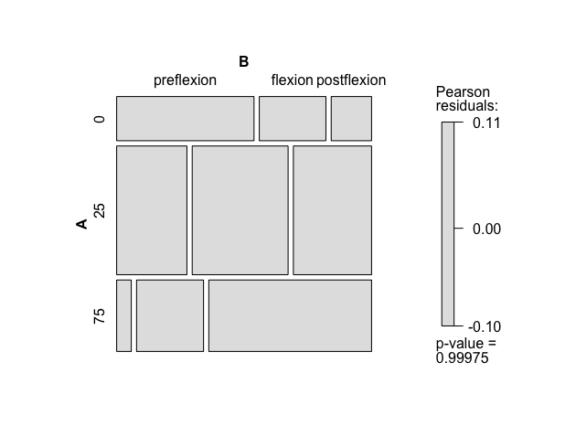
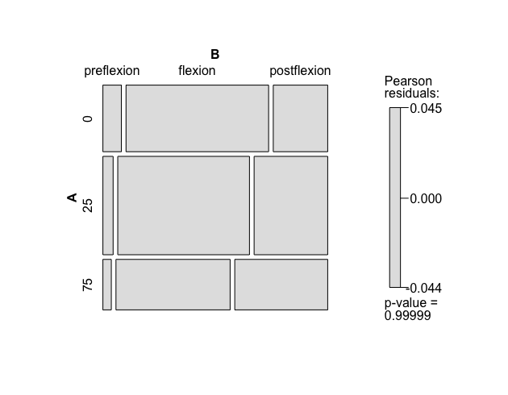
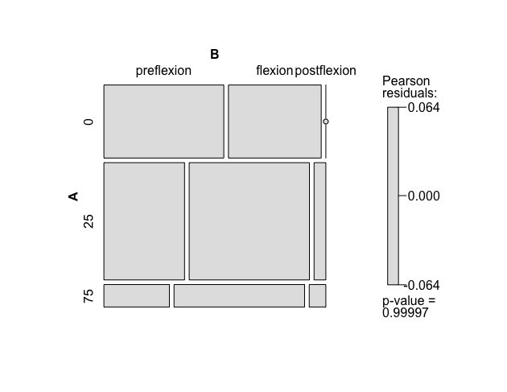

class: middle, center, blue-text, text-darken-2
# The empirical chapter outline
---
# Chapter aims
- To investigate the ontogenetic vertical migration of reef fish families off the eastern coast of Australia
  - *Question 1*: Is ontogeny the major driver of change in depth?
  - *Question 2*: Is there an overall trend downwards for ichthyoplankton during ontogeny or is it taxa specific?
  - *Question 3*: If there are changes, at which stage does it occur pre-flexion / flexion / post-flexion
  - *Question 4*: Is length a better predictor than ontogenetic stage?
---
class: middle, center, blue-text, text-darken-2
# Methods
---
# The reef fish
- Reef associated fish were identified down to eight families:
  - Scarid (9 species)
  - Labrid (81 species)
  - Synodontid (7 species)
  - Scorpid (13 species)
  - Mullid (11 species)
  - Pomacentrid (64 species)
  - Serranid (30 species)

(species lists from FishBase.org)
---
# Study sites
- Collected along the eastern coast of Australia in June 2015 (Brisbane to Sydney).
- 16 stations
  - Separated by latitude
    - North 27.3-29.1 and South 31.6-32.3 (SST differed by 1-2 degrees )
  - Separated by water features (coastal waters and eddies)
  - Data collected on SST, chlorophyll-a fluorescence, salinity
---
# Collection
- Three depths used with 500 micron mesh
  - Neuston nets used to collect the surface
    - Unbalanced design: No nets at site 16 because of rough weather and no flow meter at site 8
  - EZ nets getting two depths (5-50m, 50-100m)
---
# Data
- Standardised to count data / m3
- Removed and extra tows
- Two sites are unbalanced?
- Used a 2x2 contingency table (does it require count data > 0) and chi-square tests
- Need to investigate log-linear models??
---
class: middle, center, blue-text, text-darken-2
# Results
---
# Summary
We caught 2827 fish in these 7 family groups

Family        | Count
--------------|------
labridae      | 1252
mullidae      | 244
pomacentridae | 194
scaridae      | 228
scorpaenidae  | 176
serranidae    | 593
synodontidae  | 140

Stage | Count
------|------
Pre-flexion   | 1089
Flexion   | 856
Post-flexion   | 882
---
# Ontogeny summary
Unbalanced counts in each group (especially serranidae - bias of nets or swimming ability?)

---
# Sites
Not all stages (or families) caught at all sites, Labrids most consistent

---
# Location (Northern or mid-NSW)
Location doesn't appear to be a factor

---
# Feature (Coastal water or Eddies)
Labrids and scarids (older) found 2x more in eddies

---
# Ontogeny and depth 1

---
# Ontogeny and depth 2
- Labridae - majority caught in the 5-50m bin.
- Mullidae - hardly any PRE caught below 50m (drops off in both Pos & Fle too)
- Poms - No pos caught at surface. Also not many below 50m
- Scaridae - similar patterns at each depth.
- Scorpion fish - Opposite trends in surface and > 50m. Similar at 25m
- Serranids - huge number of pre-flexion, drops off at 50m. Flexion, post-flexion most caught below 50m
- Synodontids - Pre-flexion at surface. All mostly occur 5-50m.
---
# Labrid

---
# Labrid
- Most fish caught in 5-50 metres
- Preflexion peaks in 5-50
- Flexion similar across levels
- Post-flexion peaks 50-100 and 0m.
---
# Mullidae

---
# Mullidae
- Most fish caught in 0-50 metres
- Preflexion / flexion / post-flexion similar 0-50
- Flexion dominates mullids found below 50m
---
# Synodontidae

---
# Synodontidae
- Most fish caught in 0-50 metres
- Preflexion mainly at 0m
- Flexion dominates lizardfish found below 50m
- Post-flexion always least common
---
# Serranids

---
# Serranids
- Most fish caught in 0-50 metres
- Preflexion mainly caught 0-50
- Flexion and preflexion caught equally 50-100
- Post-flexion hardly caught 0-100, increases with depth
---
# Scorpenids

---
# Scorpenids
- Most fish caught in 5-50 metres
- Preflexion mainly caught 0
- Flexion equal % 0-100
- Post-flexion increases with depth, dominates > 50m
---
# Scarids

---
# Scarids
- Most fish caught in 5-50 metres, equal amount surface and deep
- Not many preflexion.
- Pre-flexion, flexion decrease with depth, post-flexion increases
---
# Pomacentrids

---
# Pomacentrids
- Most fish caught in 5-50 metres, not many below 50m
- Not many post-flexion (increased swimming ability?)
- Pre-flexion decreases with depth, flexion and post-flexion increases
---
# General length data
family | length_mean | length_sd
------|---------|--------
labridae  |  5.92 | 2.80
mullidae  |  7.44  | 6.31
pomacentridae  |  3.88 |  1.50
scaridae |   5.90 | 1.75
scorpaenidae  |  5.15 | 2.16
serranidae  |  3.32 |  1.47
synodontidae  | 10.35 | 6.53
---
# Discussion
