# Type specimens for reef ichythoplankton

These are the type specimens for different sub-family level taxa found amongst the reef fish collected on the RV Investigator voyage. 

##Labridae

###A
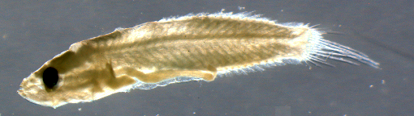

###B
###Preflexion

###Postflexion
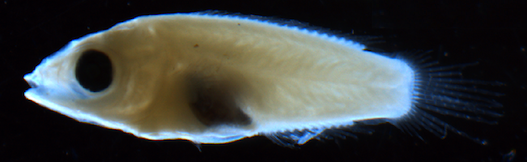

###C
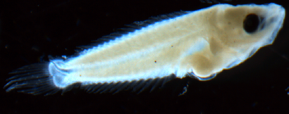

###D
###Preflexion
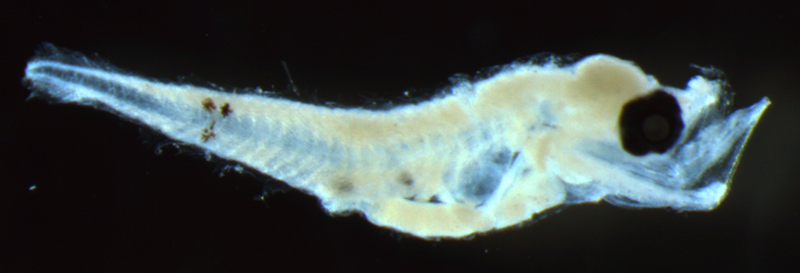
###Postflexion
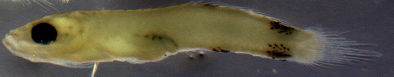
Labrid D is notable for the patterns on the tail

###E
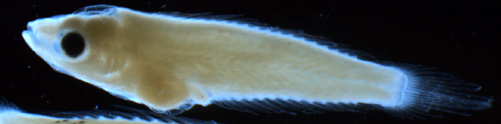  

###F
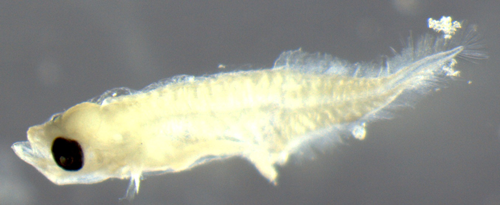  

###G
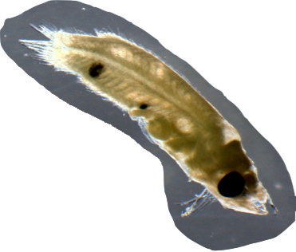

###H
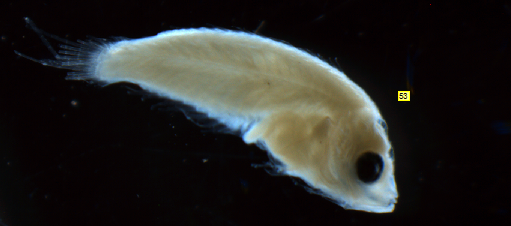

###I
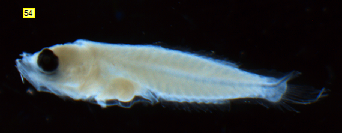

###I
####Post-flexion

## Scaridae

###A
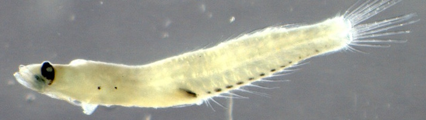

## Pomacentridae

###A
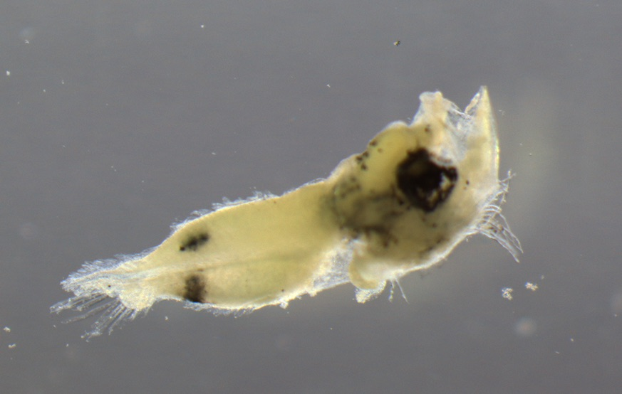

## Synodontidae

###A
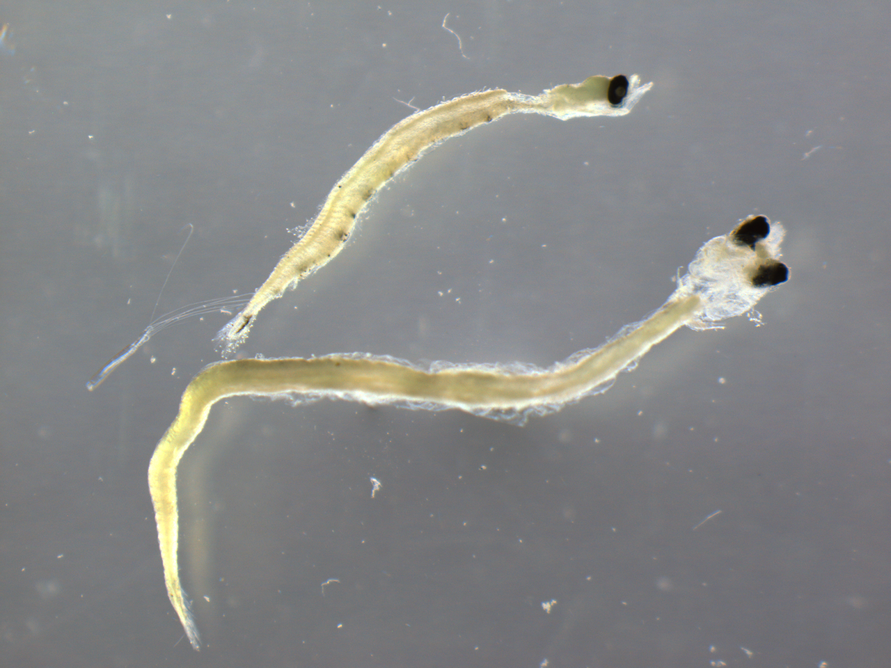

## Serranidae

###A
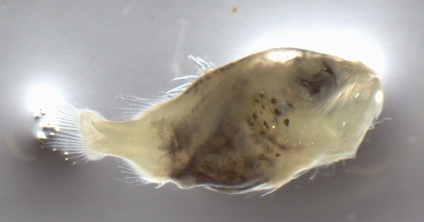

###B
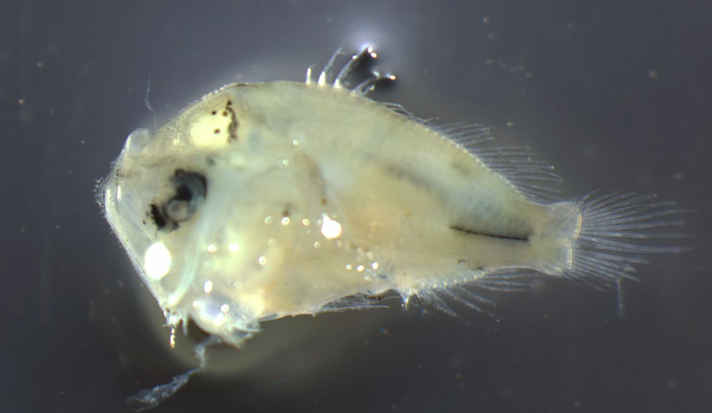

###C
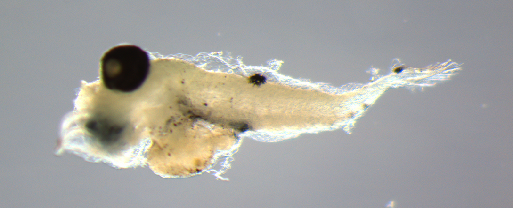

###D
####Flexion

## Triglidae

###A

## Scorpaenidae

###A
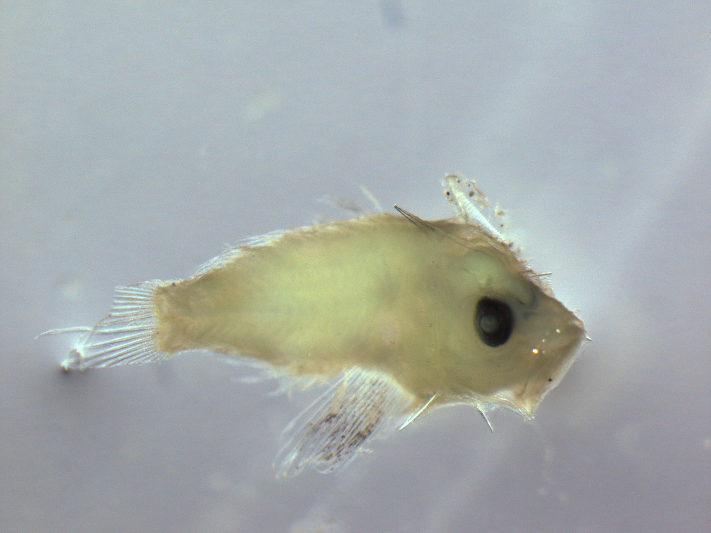

##Mullidae
###A
####Flexion

####Post-flexion

##Bothidae
###A
####Flexion
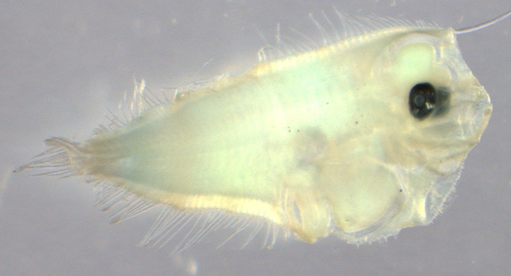

