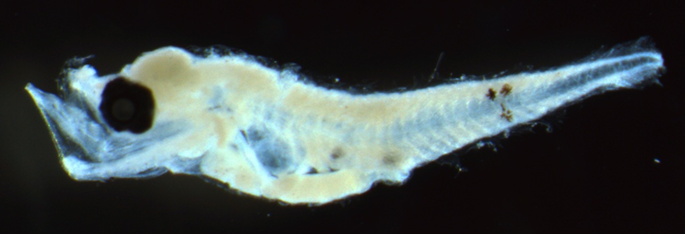
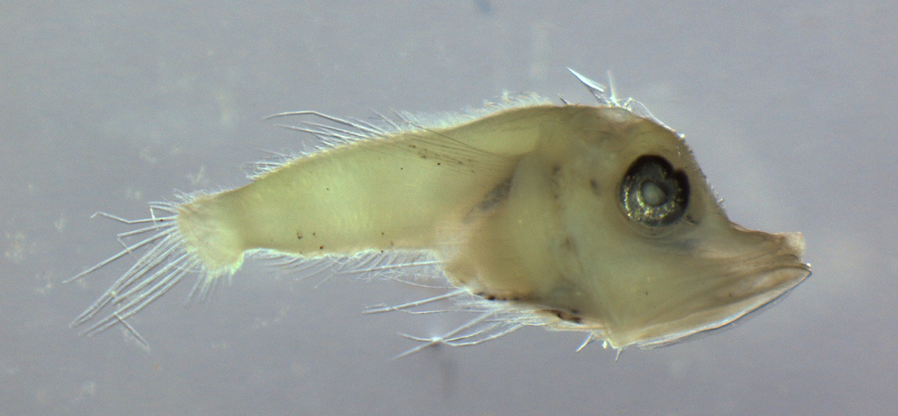

# Type specimens for reef ichythoplankton

These are the type specimens for different sub-family level taxa found amongst the reef fish collected on the RV Investigator voyage. 

##Labridae

###Labrid A
###Postflexion

###Labrid B
###Preflexion

###Postflexion

###Labrid C
###Flexion

###Labrid D
###Preflexion

###Postflexion
  

Labrid D is notable for the patterns on the tail  

###Labrid E
###Postflexion

###Labrid F
###Preflexion
  

###Labrid G
###Flexion

###Labrid H

###Labrid I
###Flexion

###Labrid J
####Postflexion
 

## Scaridae

###A

## Pomacentridae

###Pom A
  

###Pom B
  

###Pom C
  

## Synodontidae

###A

## Serranidae

###Serranid A

###Serranid B
####Preflexion

####Flexion

###Serranid C
####Preflexion

###Serranid D
####Flexion

###Serranid E
####Postflexion

###Serranid F
####Preflexion
  

####Postflexion
  

###Serranid H
####Flexion
  

##Triglidae

###Trig A

## Scorpaenidae

###Scorp A

##Mullidae
###Mullid A
####Flexion

####Post-flexion

##Bothidae
###Both A
####Flexion

