# Title
Review of biophysical modelling in investigating connectivity patterns in marine species with a pelagic larval stage. 

# Introduction 
Biophysical modelling has been used to investigate marine larvae dispersal patterns for nearly 30 years {Bartsch:1988vg}. Biophysical connectivity models typically focus on marine species with distinct sedentary adult and a pelagic larval life stage. Modelling the pelagic larval stage of these species, allow us to infer their distributional patterns. Biophysical models produce potential patterns of connectivity using a physical (i.e. oceanographic) model coupled with a model of the known biology of the larval stage. Biophysical models are powerful research tools, allowing us to investigate these potential connectivity patterns over large spatial scales {Andrello:2013cc}{Treml:2015bt} and over long temporal scales {Richar:2014cg}{Berglund:2012cr}, scales that empirical studies cannot capture. These models also provide us the ability to investigate how different early-life history traits (e.g. mortality, swimming ability, and orientation) affect the patterns found in connectivity studies {Butler:2011wu}{Staaterman:2012ek}. Thus we can ask important question about how these factors influence connectivity; experiments that are largely intractable *in situ* due to the inherent difficulties of studying the larval phase of marine species.

This review began from an attempt to identify and understand the importance of biological parameters on the connectivity patterns of ichthyoplankton. We know physical patterns are the driving force in moving ichthyoplankton around the world's oceans, however, it is now well understood that biological factors also influence where these larvae settle. This intended aim was to understand what biological parameters people were implementing in their biophysical models, i.e. was there a consensus of the most important, and how these biological parameters influence the connectivity patterns as measured through common metrics. If we can ascertain the importance of biological parameters in influencing these patterns, we can then ensure we target collecting the empirical data on these traits and behaviours. In addition, an inherent challenge in connectivity modelling is the difficulty in verifying the output as proportional to the spatial and temporal scales used in the model. Progression in the field requires that we have a degree of confidence in the accuracy and precision of the modelled patterns especially where it is difficult to empirically replicate the results. Therefore, understanding what input parameters are required to maximise model accuracy (with well understood trade-offs such as execution time) that allow us to infer compelling conclusions is another aim of this review.

The last major review in the area of ichthyoplankton biophysical modelling was undertaken a decade ago {Miller:2007iu}. We wanted to see if the biological processes found in this review were still relevant in recently published models, even though our focus was on connectivity models. For example, had emergent processes like growth become standard in models now or was there a new consensus of parameters to implement? In addition to this review, the International Council for the Exploration of the Sea (ICES) published a comprehensive and well defined manual on the recommended practices for modelling connectivity in 2009 {Anonymous:2009tx}. High-performance computing has also become more accessible to researchers in the last decade, with researchers becoming more programming literate and the decreasing start-up costs of high-performance computing. Therefore, it is hypothesised that models will become more common in the recent literature and that these models will have a higher inherent complexity, as the tools and knowledge to construct these models are more ubiquitous. Whilst our research interest lies in the connectivity patterns of ichthyoplankton, we reviewed studies of a variety of marine species with a pelagic larval stage, owing to negligible differences in input parameterisation. 

The second major aim of the review was see how different behaviours affected the connectivity patterns using a meta-analysis. By understanding which parameters had greater effects on the output will allow us to concentrate correctly parameterising these to produce better quality models. It also allows us to focus our efforts on collecting the empirical data on these behaviours if we can identify an overall trend. 

[Talk about wanting to look at the influence of different modelling choices on metrics]

The scope of this review therefore was to understand the parameters used in these models and how these input parameters effect the dispersal patterns generated.

##Review aims: 
1.  To identify the suite of parameters, both physical and biological, that recently published biophysical models are using, along with the metrics used to measure the output of these models.
2.  To compare the effects of implemented larval behaviours on the connectivity patterns generated by biophysical models, as measured using common metrics

##What is not covered?
E.g. Discuss that the accuracy of individual models was not added for effect.

# Methods
##Literature search
Our review used the keywords connectivity, model* and marine, querying the online search engines ISI Web of Knowledge and SCOPUS. Seventy-six studies matching these criteria, published in 34 different journals, were found (the full list of references and the data extracted is provided as part of the Supplementary materials). Our review search was limited to publications from 2009 as this was when a manual had been published, recommending the way forward for biophysical connectivity models {Anonymous:2009tx} and also close to the date the last review in this area had been conducted {Miller:2007iu}.

##Data classification
Most studies performed multiple executions of their model, involving different input values for one or more parameters. This could be either to test the effect of different parameters or different species were modelled for their connectivity patterns. We identified these criteria for each model specified in the study, not just the overall parametrisation of the paper. Many studies either only conducted a single model run or changed a single parameter, however, one study executed 99 different parametrised model runs. 

Each biophysical model run was classified using four categories. The first was general information about the study, such as study motivation, location, model species, and whether the system tropical or temperate. Study motivations were classified based on the broad aim of the study: climate change, marine park connectivity, dispersal & settlement, and theoretical. Climate change objectives identified temporal and spatial changes in larval connectivity patterns with increases in ocean temperatures. Marine park connectivity studies determined the extent of connectedness of either existing or potential marine parks for various species. Dispersal and settlement approaches were interested in the dispersal or settlement of a species using known input parameters. Theoretical approaches to connectivity studies investigated how different larval parameters effected the patterns of connectivity. The second category focused on the inputs used to parametrise the physical model. Assessing the physical model included details such as the oceanographic model used, the particle tracking software, diffusion methods and the model time-step.  The third category considered the input parameters of the biological model, recording the traits such as the pelagic larval duration and spawning times and the behaviours implemented, e.g. mortality, vertical migration and growth. The fourth and final category recorded what metrics were used to measure the output of the connectivity biophysical model, which consisted of both common and rare metrics. The metrics used varied considerably, with in-excess of 25 different metrics used to describe the patterns of connectivity. These metrics ranged from common metrics such as dispersal kernels and connectivity matrices to metrics unique to the study (@tbl:definitions). These metrics can be broadly categorised into two related classes. The first is purely dispersal, which using the dispersal kernel, provides metrics of spread, distance and direction travelled. The second class described the settlement of larvae, using measures such as self-recruitment, local retention and settlement success.

To compare how the input parameters of these biophysical models, physical and biological, affected the output, the metrics found to be most prevalent were used. Metric data was averaged for each model execution, e.g. the self-recruitment values across all X sites were averaged to get a single parameter. Linear regressions (*and Kruskall-Wallace tests*) were used to test for sensitivity of parameters to output metrics.

##Statistics and data
Data was derived from figures where possible, using the free software package GraphClick (version 3.0.3; http://www.arizona-software.ch/graphclick/). Data analysis was conducted using the R programming language version 3.3.2 {RAlanguageanden:wf}, using the package *tidyverse* to manipulate the data {Wickham:2016te} and the package *ggplot2* to produce the figures {Wickham:2009tn}.

*Should there be more in this list?*

: The definitions used of terms used in biophysical connectivity papers that are referred to in this review {#tbl:definitions} 

|         Term        |                                                                                      Definition                                                                                     |
|---------------------|-------------------------------------------------------------------------------------------------------------------------------------------------------------------------------------|
| Self-recruitment    | The percentage of recruits to a site, that were natal to that site {Burgess:2014cf}                                                                                                 |
| Local retention     | The percentage of the larvae natal to a site that recruited back to that site {Burgess:2014cf}                                                                                      |
| Settlement success  | The percentage of recruits natal to a site that successfully recruited to a site                                                                                                    |
| Dispersal kernel    | The probability density function of the dispersal distance for the larvae released in the system                                                                                    |
| Connectivity matrix | A matrix with columns specifying natal sites and rows specifying settlement sites, showing the probability that a larva is born in one site and settles at another {Burgess:2014cf} |

#Current trends in biophysical connectivity modelling
Of the study motivations classified, the overwhelming motivation for using a connectivity biophysical model was to answer questions about dispersal and settlement (@fig:motivation). Dispersal models without settlement and studies motivated by investigating marine park connectivity occurred in equal frequencies. Theoretical and climate change were motivations used only occasionally amongst these review papers. Understandably, climate change models are not that common, as predicting connectivity patterns in 50-100 years, using current hydrodynamic modelling has inherent predictive complications. Interestingly, there were few studies using a purely theoretical approach to understanding the biology that influences connectivity, although many studies indirectly accomplished this within some other more applied context, e.g. using multiple species in a study that have varied behaviours or traits.

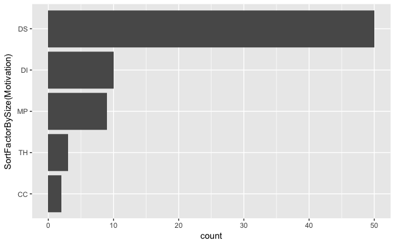{#fig:motivation}

The studies in this review used hydrodynamic models covering 20 oceanographic regions across the world, two studies even used investigated connectivity patterns at a global scale (@fig:ocean_regions). Similar to Miller's 2007 review, the modelling effort was concentrated in highly industrialised fishing regions, such as the North-East Atlantic coast and the Mediterranean Sea. Most studies were in temperate waters (65%), however unlike Miller's (2007) review, there was a noticeable increase in the number of tropical studies, up from 4% of studies to 35% of studies. 

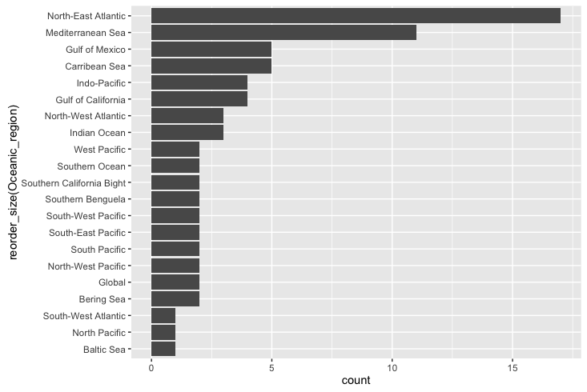{#fig:ocean_regions}

Almost all studies used an established biophysical connectivity model (82.6%), only 16% of studies constructed a new biophysical model for their  connectivity study. The three most popular biophysical models used amongst the reviewed studies were Ichthyop ({Lett:2008fo};18.67%), Connectivity Modelling System ({Paris:2013fs};12.0%) & MGET ({Roberts:2010df};8.0%). Overall, it was determined that 21 different biophysical models (ignoring version numbers) were used amongst the studies, although we were unable to identify the exact particle tracking model used for nearly one quarter of the papers (22.7%). The studies used forecasting models to run their connectivity studies, with one exception - a hindcast solution whereby the larvae are initially tracked from settlement sites to determine their natal sites {Wren:2016gu}.

##How connectivity studies are parametrising the physical models
Although this review primarily focuses on the biological part of the coupled model, as we are both ecologists, we will report some findings of the physical models used. The choice of oceanographic model depends upon the region the connectivity study is taking place in. The two most common ocean circulation models used were the Regional Ocean Modelling System (ROMS; 25.3%) and the Hybrid Coordinate Ocean Model (HYCOM; 17.3%). Nested circulation models were used in the more complex particle trackers to bypass issues of low resolution in modelling. The mean resolution of the largest resolution used in these connectivity models was 5.6km^2, with extremes ranging from a precise 50m^2 {Brennan:2014fm} to broader 33km^2 {Crochelet:2013kr}. As seen in Miller's 2007 review, there was no trend over time towards high resolution models. 

The time particles updated in the system (environmental forcing) were either fixed time-steps or varied per other factors. The median time-step was one hour, and ranged between 60 seconds {Moritz:2013dc} and 24 hours {Mora:2012kn}. The time-step used was not reported in 37.3% of the papers. The choice of time-step is determined by both the physical model and computational choices, and no rational was given for the decision in those studies. There was no relationship of time-step choice on the metrics of dispersal or settlement, therefore it is integral to be accurate when resolving oceanographic forcing. The models used different time-scales of oceanographic data depending on the trends of interest (inter- or intra-annual). Studies trended towards running the biophysical model using only the time-scale of a few years  (median = 3 years) (@fig:modelled_years) with the majority using only a single year  in their connectivity study. Only one study used the average of several years input data to interpret mean connectivity patterns {Feutry:2013je}. Other outliers included studies investigating climate change scenarios, which used periods of 60 years {Aiken:2011dv} and 130 years {Andrello:2014ge}. In these studies, the earliest year modelled was 1950, and the latest year modelled was 2100 (using ocean current data based on past averages). The average of the dates modelled was a start date of 2001 with an end date of 2008. Although not all models used continuous years as input, some studies only used specific years as input. As high powered computing becomes more available and with the known variability between consecutive years in hydrodynamic modelling, the trend for biophysical models should hopefully be towards using longer periods of ocean data as input. Inputting more years also allows for inter-annual comparisons in connectivity patterns. 

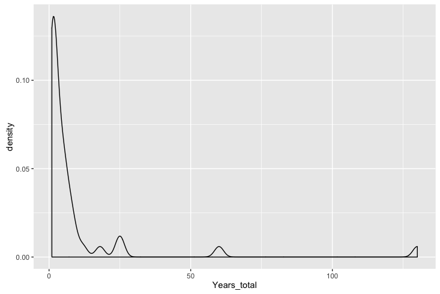{#fig:modelled_years}

##How connectivity studies are parametrising the biological models
In the papers we reviewed, biophysical connectivity modelling has been a regular research tool for understanding connectivity patterns. Ten marine taxonomic groups, and a generic marine taxonomic group, were used in the modelling (@fig:taxa). The generic taxonomic group was used by studies that defined as a suite of biological parameters that could potentially apply to multiple species, e.g. many species of reef fish most likely have a pelagic larval duration of 20 days. Generic species were used in 40.2% of the total executed model runs amongst the papers. This was skewed by one study executing 99 model runs using a suite of generic parameters {Treml:2015bt}. The 10 known taxonomic groups were comprised from 47 species and another seven where the modelled biological group was specified at the family level, e.g. Labridae or Sparidae.  The two most common taxa modelled were fish (39%) and bivalves (10%).

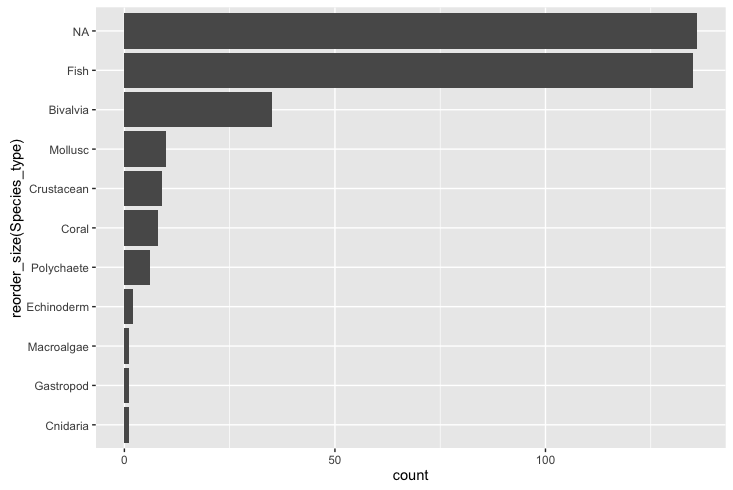{#fig:taxa}

The biological models implemented were not consistent across studies. The only biological parameters that were consistent and implemented across nearly each study in this review were the trait of pelagic larval duration (100%) and the spawning behaviour (98.3%; as mentioned previously there was a single hindcast study). It is not abundantly clear why there is no consistency in the traits and behaviours captured by the biological models. The possible reasons could be that researchers do not agree that biological has much influence on connectivity patterns, that certain traits and behaviours are species specific, or that there is not enough empirical evidence to parametrise the model with confidence.

: The behaviours that have been implemented in the modelled connectivity studies. Note that multiple behaviours can be implemented in the one model {#tbl:behaviours} 

|        Functionality         | Implemented(%) |
|------------------------------|----------------|
| Pelagic larval duration      |          100.0 |
| Settlement competency window |           48.3 |
| Spawning strategies          |           98.3 |
| Mortality                    |           41.0 |
| Growth                       |            6.7 |
| Sensory ability              |           58.3 |
| Orientation                  |            2.6 |
| Swimming behaviours          |           25.7 |

Information on the length of time an organism will spend in the pelagic environment prior to settlement at a site is fundamental to any attempt at transport modelling.  As such, this period, often termed the pelagic larval duration (PLD) is a core parameter found in every study we reviewed (@tbl:behaviours). The studies we reviewed exhibited two different approaches when implementing the pelagic larval duration. The standard approach (92.4% of models) was to make the PLD value a fixed for each larva. If the individual larva reaches this time, it either must settle (if possible) or it is considered dead. The other approach was to implement some variability in the PLD (5.6% of models), either using a Gaussian distribution (based on knowledge of the population) or instead of using time, make the PLD dependent on ocean temperature. The fixed PLD values ranged from 2-420 days, with a median value of 30 days (@fig:pld_range). The PLDs were, in general, taken from known ranges found in the literature, with the highest values modelled for invertebrate species e.g. the long duration (~400 days) of the phyllosoma stage of some lobster larvae {ButlerIV:2011kq}{Kough:2013fa}.

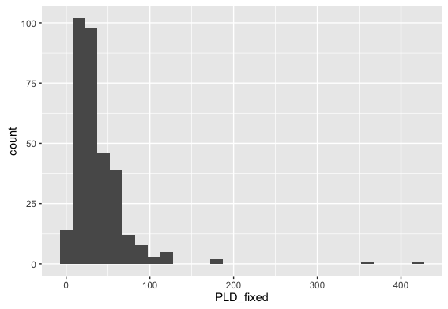{#fig:pld_range}

PLDs were often used in conjunction with a settlement competency window (48.7%). The settlement competency window gives the marine larvae a period in which they can settle before they reach the end of their pelagic larval duration. It is generally based on their known biology, incorporating the idea that most species with a pelagic larval phase must develop sufficiently before the pelagic stage can finish. The range of start dates for this window were 0-152 days, with a median start date of 9 days when the larvae were considered developed enough to settle.

A second fundamental element, included by necessity, in every study in our review was some sort of spawning strategy which determined how the larvae were released in the model. The spawning strategy was typically dependent on the biology of the modelled taxa and included pelagic eggs, demersal eggs, or brooding. In order to implement these different strategies, studies changed depth for the release of the larvae, e.g. demersal eggs were released on the bottom of the natal reef and pelagic eggs were released higher up the water column. The two strategies for releasing the particles at depth were either to use a fixed depth (37.5%), or to randomly release the larvae over a range of depth values (60.8%), i.e release larvae in in the 0-20 m range of the water column. The timing of when larvae were released varied from hourly intervals {Jacobi:2012cz}, daily {Kough:2013fa}, monthly {Staaterman:2012ek}, on lunar cycles {Davies:2014cw} or just a one-off spawning event {Herbert:2011bh}. The spawning windows relied on the known biology and what times of year the species is known to produce larvae. In general, spawning events were pre-determined, but several studies used temperature as a spawning initiation {Andrello:2014ge}{Rochette:2012io} or even wave height was used to release abalone larvae in one model {Miyake:2011hr}. In general, the release sites and settlement sites were same sites. However, in several studies with known release sites, there were many more available settlement habitats for the larvae. The larvae spawned at each site ranged from only 10 larvae to 10,000,000, with a median of 6800. The overall larvae tracked in the system (spawning site x number of sites x number of releases) had a similarly large range, from 328 to 610,000,000 larvae, with a median total of 3.2 million. To get around tracking these large numbers of larvae in the system, five studies (15.6%) used the concept of a super-individual, whereby a single larvae in the system represents a larger number of larvae with a normalised collection of attributes. There are large computational benefits to this approach, especially in models that use a continuous space. The caveat is that you have to consider how much individual variation you are willing to lose by modelling these super-individuals.

*WILLS COMMENT: Would it be possible to give the average number of larvae released from a site that were used to make one connectivity matrix?  This would differentiate situations where, for instance they released 100,000 larvae from each site, ran them out and made a matrix and they did this every week…so one matrix per week.  As compared to another study which may have released 100000 ever week for a month and then used all this info to make one matrix.  The idea would be to give some sort of guidance on the amount of larvae people seem to think is enough to generate a single estimate of connectivity.*
*STEVES COMMENT: I would have to go back and check this out, mostly they provided one connectivity matrix or perhaps one per month or year. Will take me half a day to comb through all the papers again, but I can do it. I'll wait to see if there are other things I need to look for as well*

Larval mortality was implemented in only 41% of the models (@tbl:behaviours). However, the implementation of mortality varied across the models, the most common mortality function used was a linear function (82.2%), whereby a fixed  percentage of the larvae were killed each day. The daily mortality rate in these studies varied from 1.7% to 30.0% with an average of 19.4%.  Other  mortality implementations were to kill the larvae based on a known temperature or salinity threshold (7.9%), using a decay function that decreased mortality based on age (7.9%) or using a Weibull function (2.1%). Unlike in Miller's 2007 review, where growth was implemented in one-third of the studies, only 6% of the models reviewed had the ability for larvae to grow built in (@tbl:behaviours). The rationale is that the models used in this review are solely investigating connectivity, where growth is not considered such an important factor affecting the strength of connectivity amongst sites, unless it is co-implemented with a sinking velocity dependent on mass.

Individual model executions were classified into four the major behaviours that are implemented for connectivity studies (ignoring spawning in this comparison); no movement (passive movement), movement (e.g. horizontal or vertical swimming), orientation (ability to orientate towards a reef using cues) and settlement (settle at a site using a sensory buffer or sticky zones). Passive movement was the most commonly behaviour to be implemented, almost double that of models with moving larvae (@fig:years). 

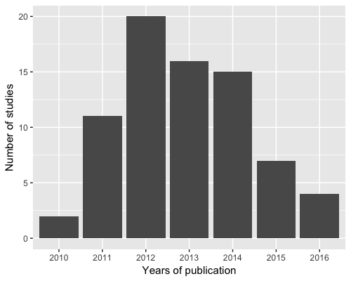{#fig:years}

Larvae were given the ability to move in 26% of the models, conversely in 74% of the models the larvae were assumed to be passive and moved by the physical model. Of the behaviours classified as movement, diel vertical migration was the most commonly implemented behaviour for the pelagic larvae (45.4%; @tbl:swimming). Ontogenetic vertical migration, the idea that marine species change their vertical position in the water column as a factor of their ontogeny, was used in 27.2% of the models. Horizontal swimming was implemented in 12.5% of the models, although it must be mentioned that random movement to mimic turbulence does capture an extent of undirected horizontal swimming. A smaller number implemented vertical swimming in the larvae (4.5%). Other movements included in models were prompted by environmental conditions such as tides (circatidal migration 5.7%,), salinity (halocline migration; 1.1%) or following the pynocline (6.8%). Another movement implementation, as mentioned above, was using sinking velocity (3.4%) in conjunction with growth, e.g. the heavier the larvae the faster it sinks. The last strategy involved giving the pelagic eggs a buoyancy (4.5%) based on the salinity level in the water column, thus they can float at different vertical migrations.

: The percentage of ichthyoplankton models in this review which implemented different swimming behaviours. Note the percentages sum to greater than 1 because multiple swimming behaviours can be implemented in a single model. {#tbl:swimming} 

|       Swimming behaviour      | Implemented(%) |
|-------------------------------|----------------|
| Horizontal swimming           |           12.5 |
| Vertical swimming             |            4.5 |
| Ontogenetic vertical swimming |           27.2 |
| Diel vertical migration       |           45.4 |
| Halocline migration           |            1.1 |
| Circatidal migration          |            5.7 |
| Pynocline migration           |            6.8 |
| Sinking velocity              |            3.4 |
| Egg buoyancy                  |            4.5 |

The ability of the marine larvae to sense settlement habitat was implemented in 50.9% of the models. Of these, 95.4% opted for a buffer implementation, where each settlement habitat has a buffer zone added around it. The average size of the buffer zone around the potential settlement sites was 8.18 km (SD = 5.2 km). The other implementation, which essentially works on similar principles, was to give the larvae a detection distance, which was relative to the centre of the settlement site {Staaterman:2012ek}. This settlement cue was used to allow the larvae to orientate towards the reef if the larvae was within the cue distance ranging between 1-10km, with a combination of early and late onset orientating abilities. Giving the larvae the ability to orientate early improved their chances of settling, and also increased self-recruitment. 

For the studies modelling fish, implementing ichthyoplankton that moved passively in the system decreased over the reviewed period. In 2015, for the first time there were more studies using movement behaviours than other forms of behaviour (@fig:fish_prop). The yearly totals of fish based biophysical models are similar to the totals found in the previous review {Miller:2007iu}. Implementation of settlement sensory strategies seem to have remained constant over the published time period. Interestingly, the ability of fish to orientate towards settlement sites was only found to be implemented in one study in 2012. This is despite the increasing body of research in the last decade regarding the ability of reef fish larvae to orientate towards natal reefs using olfactory mechanisms {Gerlach:2007gw}, celestial cues {Leis:2014es}{Faillettaz:2015dn} and a magnetic compass {Bottesch:2016hl}. For invertebrates, there appears to be no real real change in the pattern of implemented behaviours, except for 2014 when there was a trend towards passive moving larvae (@fig:invert_prop).

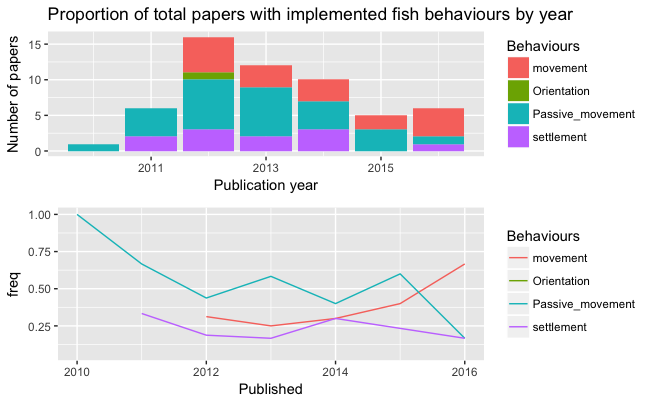{#fig:fish_prop}

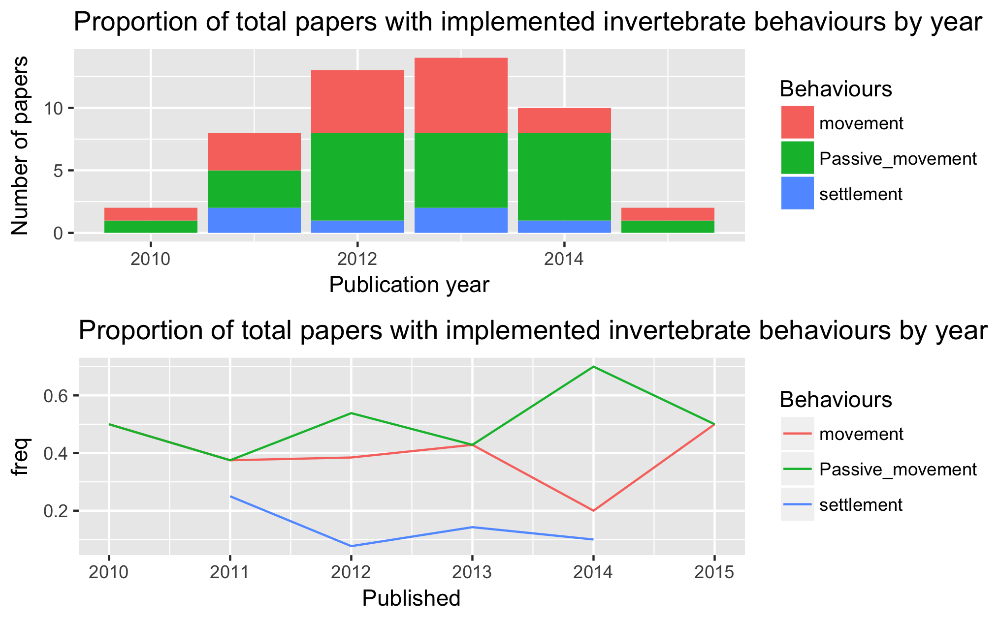{#fig:invert_prop}

This finding is extremely interesting from a biological viewpoint, as the empirical knowledge of fish behaviour influencing the outcome of connectivity {Leis:2006kf}{Cowen:2009fm}, many biophysical modelling showing how connectivity changes with behaviour, and papers suggesting the way forward is to include behaviour {Staaterman:2014ee}{Anonymous:2009tx}, there are still many studies including models with no implemented behaviour at all - passive larvae were used in 75% of model configurations. There is also a well established body of empirical literature which highlights the often extensive swimming abilities of ichthyoplankton {Leis:2006kf}{Leis:2010jz}. Even where horizontal swimming may not be important, many larvae have diel vertical migration patterns to below the mixed layer to escape predators during the day. Several studies in the review showed that vertical migration (either diel or ontogenetic) increased self-recruitment and limit the overall dispersal kernel {Young:2012gb}{Aiken:2011dv}. One reason for not implementing movement could be that the complete (or even partial) early life history is often unknown for many species, and researchers might be trying to avoid any behavioural assumptions. Fish larval behaviour is known to be species specific, yet many models are limited to using known data from the Family taxonomic level due to the lack of species specific knowledge. Such an approach for large taxonomic families like Labridae, potentially masks a large variation of behavioural traits. The lack of species specific knowledge poses the question, can we only model species where we fully understand the early life history, or is there some level of assumptions that are deemed to still be scientifically valid? 

## The metrics used to measure model output
For describing the results of connectivity studies, there was a lot of variation in the metrics used. There were in-excess of 25 different measures used to describe the patterns of dispersal and settlement. The common approaches were to use combinations of dispersal kernels (64.0%) and connectivity matrices (57.2%). Less common measures of model output were larval centre of mass (average geographical position of the larvae; 2.6%) {Lacroix:2013cf}{Miyake:2011hr}, isotropy (describes the inertia around the centre of mass; 1.3%) {Ayata:2010hg}, positive area (number of areas that had larvae in them, 1.3%) {Puckett:2014cx}, and proportion of sites settled (1.3%) {Robins:2013ih}.

The trend in biophysical modelling is to present data using visual techniques such as heat maps, which being effective, make it difficult to pull out quantified data points. The most common values we could extract were self-recruitment (the percentage of settlers at a site that were spawned from there), local retention (the percentage of spawned larvae at a site that settled there) and overall settlement success of larvae. For a detailed explanation of how these are calculated from the connectivity matrix, see {Burgess:2014cf}. We were only able to extract mean self-recruitment values from 17.5% of the published models, even though 29.7% of the papers used self-recruitment in their analysis. 

There was a large spread of the mean self-recruitment amongst the models, ranging from 0-98%, depending on the study, with a median self-recruitment value of 13.0%. Local retention, while mentioned for 31.7% of studies, we were only able to get mean local retention values for 5.5% of the models. Most people only reported potential connectivity models (potential is the probability of settlement, where realised is a more accurate measure offset by biological processes such as egg production and mortality). Mean local retention ranged from 0.3-46.0%, with a median value of 6.0%. Overall mean settlement success of the larvae was extracted for 18.0% of the studies, ranging from 0.1-80% successful settlement rates, with a median of 26.8%. 

The large range in these three metrics, especially settlement success, causes some concern about the maturity of these models. It was expected that the settlement success would be extremely low, even if mortality is not included in the system. The complicated suite of input parameters makes it difficult to tease out why the range is so large, whether it be the shape and size of the study site, high vs low resolution ocean models, area of settlement sites, larval mortality rate, length of PLDs etc. 

#What parameters are important for connectivity models

## Discuss the common metrics used for comparison
<Do I need this section?>

## Is the choice of physical parameter important?

To test the effect of physical parameter choice on connectivity metrics, we considered....
- the system (open/closed)
- model resolution
- timestep
- choice of physical model
- choice of particle model
- years model was run
- nested models or not

To see if there was an effect of the modelled geographical area on settlement, the regions were broadly categorised into open (coastal, island) or closed (bay or inland sea). There was no noticeable effect of geographical area on self-recruitment, however closed systems had double the median settlement success rate. This makes sense as in a closed system the choices of settlement sites for larvae are increased. Open systems will have higher degree of unsettled larvae as many are swept out into sea and away from settlement regions. There were not enough data points on local retention for comparison on geographical location.

There was no relationship between either model resolution or nested models on the metrics of settlement or dispersal. This was unexpected given that sub-mesoscale processes are expected to be more accurately captured in the hydrodynamic model as the resolution increases, as would the connectivity patterns of the modelled larvae, e.g. increasing self-recruitment as small eddies trap larvae close to natal reefs.

## Is the choice of biological parameter important? 

###Swimming behaviours
Models which included movement or settlement sensory had overall lower mean self-recruitment levels than those which did not (@fig:behaviours_sr, INCLUDE STATS). This is an unexpected result, considering the overriding consensus is that self-recruitment is increased through behavioural implementations in the model (CITES). While the maximum values for mean self-recruitment are higher with behaviour, other model parameters specific to the studies could be influencing this trend. If both these behaviours were included, then self-recruitment increased, although there are fewer data points for comparison. The large spread of values for self-recruitment, ranging from close to 100% down to almost none, also suggest that the is a mix of parameters influencing the self-recruitment seen in models.

The opposite trend appears to occur for settlement success (@fig:behaviours_ss). The highest settlement success occurred when multiple behaviours of movement & settlement or movement & orientation & settlement were all included in the model. Unfortunately there were not many studies that included orientation to draw meaningful comparisons about the influence of orientation on connectivity patterns, but the strong assumption is that it would also increase settlement success, as shown in individual studies {Staaterman:2012ek}. 

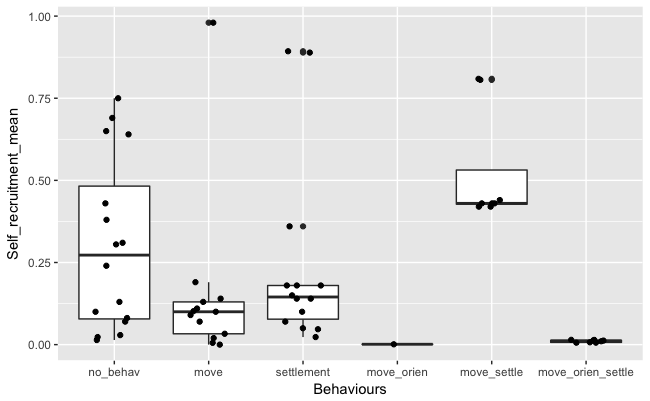{#fig:behaviours_sr}

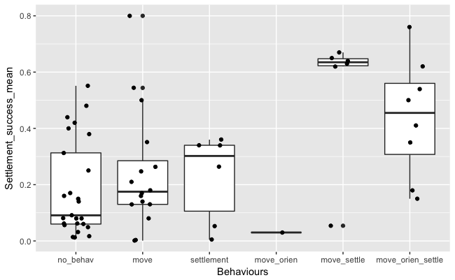{#fig:behaviours_ss}

##Settlement competency
The length of the settlement competency window (from the beginning age of settlement to the pelagic larval duration) had no effect on the mean settlement success. It did have a slight positive correlation with self-recruitment (r^0.27, df=18) and a strong negative correlation with local retention (r^0.70, df=9). (*Note: Do I want to show these graphs?*)

### Mortality
Including mortality in the model increases the mean self-recruitment (@fig:sr_mort). There was not much change in the mean overall settlement success, however mortality limited the spread of the percentage that successfully settled (@fig:ss_mort). Including mortality also seemed to increase the mean distance travelled of the larvae, which is the opposite of what is expected (@fig:dist_mort). 

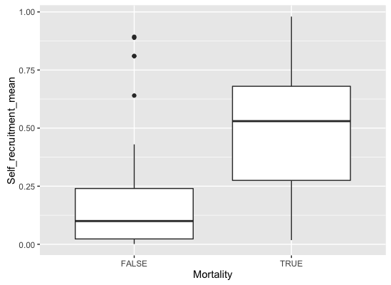{#fig:sr_mort} 

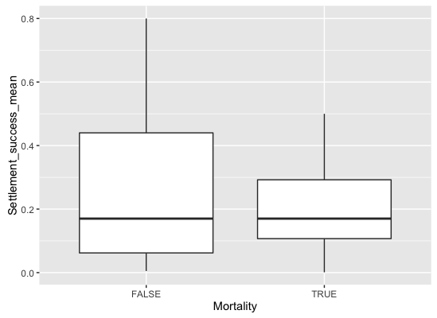{#fig:ss_mort} 

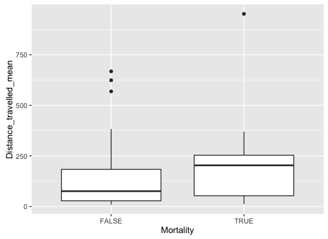{#fig:dist_mort} 

#Conclusion and recommendations

The other interesting outcome was the large spread of values reported for these studies. The common measures of self-recruitment, local-retention and settlement success all reported huge variations amongst studies. Seemingly obvious explanations such as open/closed systems did not explain the variance. These are inherently complex systems and teasing out the differences between studies is not a trivial task. The other key driver is the variability of the oceanographic currents, which change within and between years. Therefore it was interesting there were still many studies that only looked at dispersal patterns over one or two year periods, arguably not allowing the model to capture enough natural variation.

*WILLS COMMENT: You can’t just throw this in as a sentence.  What did you do, what does this mean?  Need to show that you actually looked at this in some objective manner so your argument that it can be dismissed will be accepted.You can’t just throw this in as a sentence.  What did you do, what does this mean?  Need to show that you actually looked at this in some objective manner so your argument that it can be dismissed will be accepted.*

The first caveat to such an approach is that comparisons such are difficult because of the number of parameters used to configure these biophysical models that could all have an influence on the results. This is a complicated issue to resolve. Comparing a large number of studies should cancel out some of the noise surrounding all the parameters. A future direction would be to determine a way to normalise the data based on the input parameters, allowing for more effective comparisons. Otherwise perhaps it is only prudent to compare studies that occur in the same oceanic region, at the same time, using the same physical models and perhaps the same particle disperser for consistency.

The second caveat is that is was difficult to get measures to compare amongst the papers due to the different metrics that were used. When there were common approaches of connectivity matrices, visual tools such as heat maps hid the underlying data points, impeding any meta-analysis. A consistent approach, including providing underlying data would assist in progressing the field for future comparisons, allowing us to understand why there is so much variation amongst reported measures such as self-recruitment and transport success. 

The current state of the field feels like is not moving forward as coherently it should be. Studies have been calling for behaviour to be implemented for nearly a decade, yet the majority of studies are still not including larval behavioural traits. This is despite the evidence that behaviours do change the described connectivity patterns. Perhaps we cannot move forward until these models, which include behaviour, are empirically validated. However, we would argue that the first priority should be to start including both movement and settlement sensory abilities for species where this is applicable and known in the literature. The second priority to is provide clarity in metrics so we can meaningfully compare the outcomes of connectivity studies and progress the field further.

